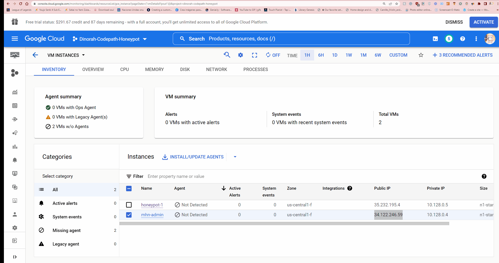

# Unit-9-Project-Honeypot
# Honeypot Assignment

**Time spent:** **25** hours spent in total

**Objective:** Create a honeynet using MHN-Admin. Present your findings as if you were requested to give a brief report of the current state of Internet security. Assume that your audience is a current employer who is questioning why the company should allocate anymore resources to the IT security team.

### MHN-Admin Deployment (Required)

**Summary:** How did you deploy it? Did you use GCP, AWS, Azure, Vagrant, VirtualBox, etc.?
I deployed my MHN-Admin using Google Cloud. I used their Google Cloud SDK Shell.

### Dionaea Honeypot Deployment (Required)

**Summary:** Briefly in your own words, what does dionaea do?
Dionaea is a honeypot to attract attacks and malware to capture them. This then can be used to analyze what type of attacks or malware certain systems are weak against t. This can help when it comes to analyzing types of attacks and weaknesses.

### Database Backup (Required) 

**Summary:** What is the RDBMS that MHN-Admin uses? What information does the exported JSON file record?
It uses MongoDB and the JSON file shows the date, ip, 

*Be sure to upload session.json directly to this GitHub repo/branch in order to get full credit.*

## Notes

Describe any challenges encountered while doing the assignment.
Instructions did not include fix for python issue at first.
